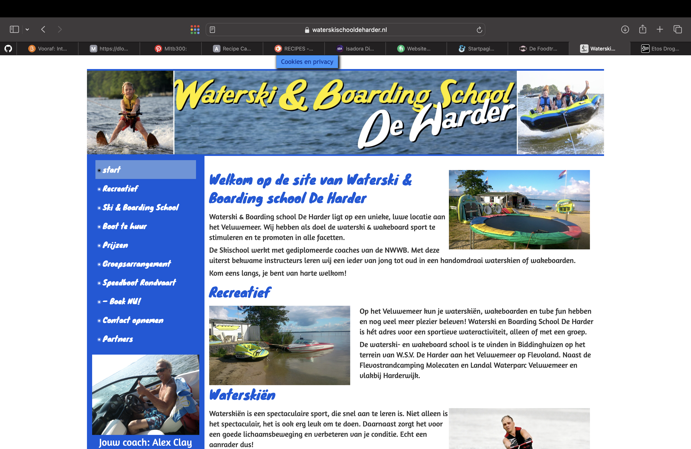
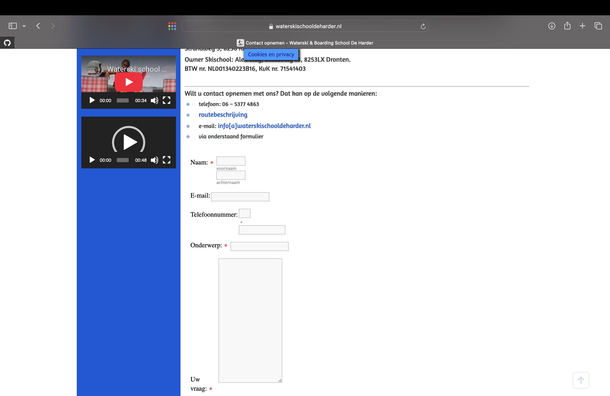
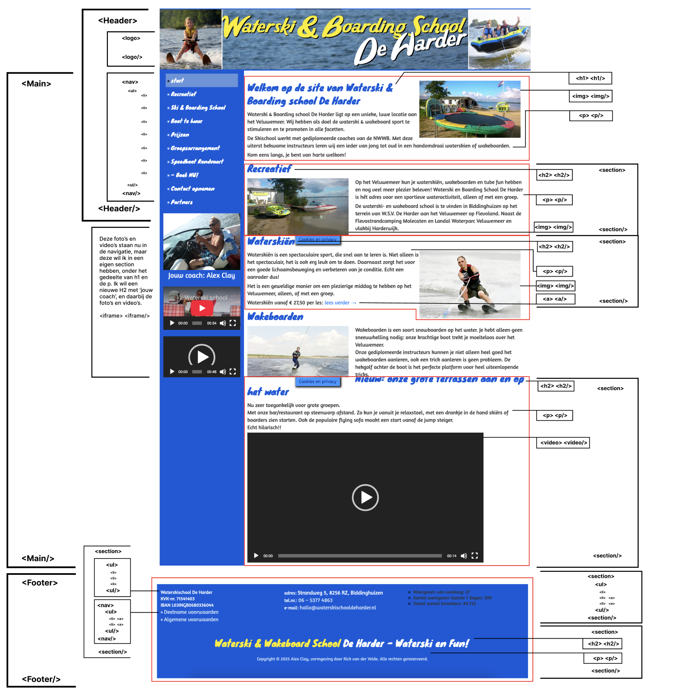
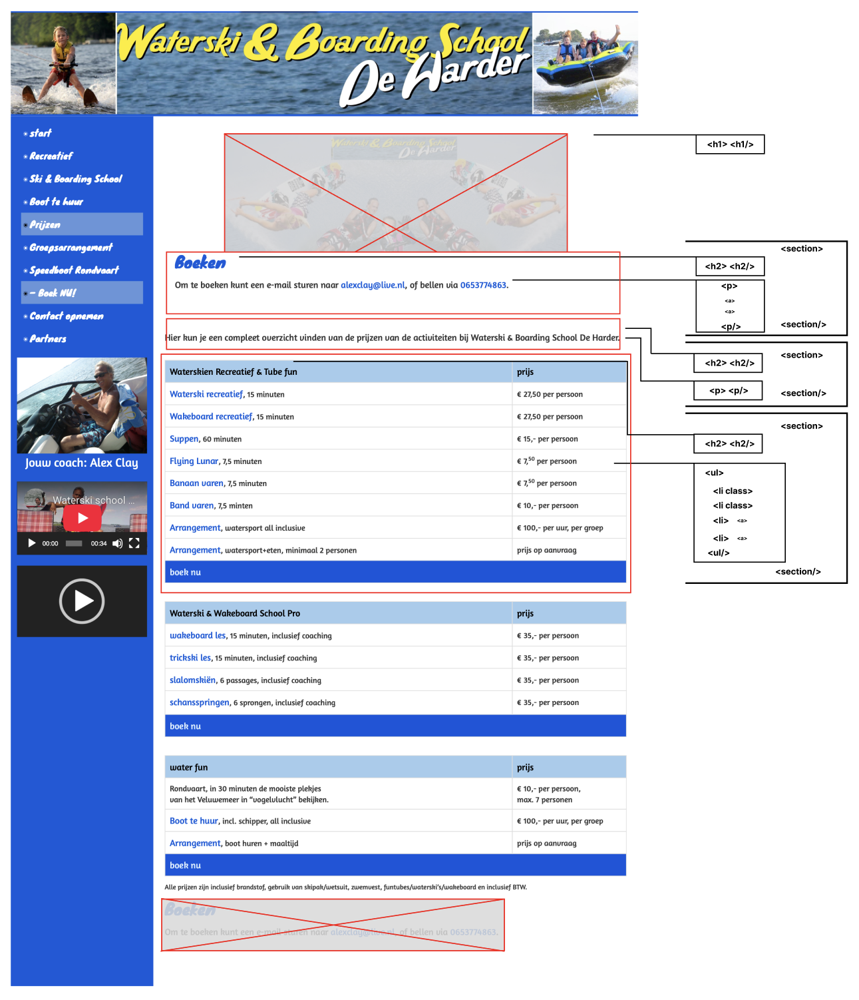

# Procesverslag
Markdown is een simpele manier om HTML te schrijven.  
Markdown cheat cheet: [Hulp bij het schrijven van Markdown](https://github.com/adam-p/markdown-here/wiki/Markdown-Cheatsheet).

Nb. De standaardstructuur en de spartaanse opmaak van de README.md zijn helemaal prima. Het gaat om de inhoud van je procesverslag. Besteedt de tijd voor pracht en praal aan je website.

Nb. Door *open* toe te voegen aan een *details* element kun je deze standaard open zetten. Fijn om dat steeds voor de relevante stuk(ken) te doen.

## Jij

  
uitwerken voor kick-off werkgroep

  ### Auteur:
  Annabel Claij

  #### Je startniveau:
  Rood

  #### Je focus:
  Responsiveness
 

## Je website

  
uitwerken voor kick-off werkgroep

  ### Je opdracht:
  Link naar website: https://waterskischooldeharder.nl 
  Dit is de website van het bedrijf van mijn vader. Het ontwerp is niet modern meer, dus ik zou graag tijd willen steken in het namaken
  en verbeteren van deze website. Ook heeft de website weinig micro-interacties, die wil ik ook toevoegen.

  #### Screenshot(s) van de eerste pagina (small screen): 
  Waterskischool de Harder Home pagina
  

  #### Screenshot(s) van de tweede pagina (small screen):
  Contact opnemen 
  
 

## Toegankelijkheidstest 1/2 (week 1)

  
uitwerken na test in 2e werkgroep

  ### Bevindingen
  Lijst met je bevindingen die in de test naar voren kwamen:
  - De startpagina heeft geen H1, 9 keer een h2 en een h3 in de footer. De screenreader leest eerst het navigatie menu en de video's, maar niet de hoofdtekst. 
  - De 'prijzen' pagina heeft een H2 en een H3, echter staan er eerst een hoop tabellen, en pas onderaan een H2. De footer is een H3. De tabellen missen dus een kop met bijvoorbeeld 'tarieven' en subkopjes.
  - de 'contact opnemen' pagina heeft geen koppen, enkel weer de H3 in de footer. Hier is behoefte aan meerdere logische koppen. 

  Wat er ook mist bij elke pagina, is een duidelijk visueel onderscheid van de koppen, ook voor mensen zonder beperking is het niet duidelijk.

## Breakdownschets (week 1)

  
uitwerken na afloop 3e werkgroep

  ### de hele pagina: 
  

  ### dynamisch deel (bijv menu): 
  

  ### wellicht nog een dynamisch deel (bijv filter): 
  

## Voortgang 1 (week 2)

  
uitwerken voor 1e voortgang

  ### Stand van zaken
  hier dit ging goed & dit was lastig (neem ook screenshots op van delen van je website en code)

  ### Agenda voor meeting
  samen met je groepje opstellen

  | Jada                                         | Daniel                           | Sid                                 |   Annabel        |
  | ---                                          | ---                              | ---                                 | ---              |
  | - hoe tekst meer naar links                  | - meerdere hamburger menu's      | - hoe advertenties                  | - hamburger menu |
  | - kan svg niet vinden | dit als er tijd is   | - font face werkt niet           | - achtergrond zoals echte website   | - nav meeschalen
  | - hoe order aanpassen van h2 en h3           | - video aan zijkanten vervagen   | - zoekbalk                          | - witruimte tekst|
                                                                                                                  

  ### Verslag van meeting
  hier na afloop snel de uitkomsten van de meeting vastleggen

  - punt 1
  - punt 2
  - nog een punt
  - ...

## Voortgang 2 (week 3)

  
uitwerken voor 2e voortgang

  ### Stand van zaken
  hier dit ging goed & dit was lastig (neem ook screenshots op van delen van je website en code)

  ### Agenda voor meeting
  samen met je groepje opstellen

  | student 1      | student 2          | student 3    | student 4        |
  | ---            | ---                | ---          | ---              |
  | dit bespreken  | en dit             | en ik dit    | en dan ik dat    |
  | en dat ook nog | dit als er tijd is | nog een punt | dit wil ik zeker |
  | ...            | ...                | ...          | ...              |

  ### Verslag van meeting
  hier na afloop snel de uitkomsten van de meeting vastleggen

  - punt 1
  - punt 2
  - nog een punt
- ...

## Toegankelijkheidstest 2/2 (week 4)

  
uitwerken na test in 9e werkgroep

  ### Bevindingen
  Lijst met je bevindingen die in de test naar voren kwamen (geef ook aan wat er verbeterd is):

## Voortgang 3 (week 4)

  
uitwerken voor 3e voortgang

  ### Stand van zaken
  hier dit ging goed & dit was lastig (neem ook screenshots op van delen van je website en code)

  ### Agenda voor meeting
  samen met je groepje opstellen

  | student 1      | student 2          | student 3    | student 4        |
  | ---            | ---                | ---          | ---              |
  | dit bespreken  | en dit             | en ik dit    | en dan ik dat    |
  | en dat ook nog | dit als er tijd is | nog een punt | dit wil ik zeker |
  | ...            | ...                | ...          | ...              |

  ### Verslag van meeting
  hier na afloop snel de uitkomsten van de meeting vastleggen

  - punt 1
  - punt 2
  - nog een punt
  - ...

## Eindgesprek (week 5)

  
uitwerken voor eindgesprek

  ### Je uitkomst - karakteristiek screenshots:
  

  ### Dit ging goed/Heb ik geleerd: 
  Korte omschrijving met plaatjes

  

  ### Dit was lastig/Is niet gelukt:
  Korte omschrijving met plaatjes

  

## Bronnenlijst

  
continu bijhouden terwijl je werkt

  Nb. Wees specifiek ('css-tricks' als bron is bijv. niet specifiek genoeg). 
  Nb. ChatGpT en andere AI horen er ook bij.
  Nb. Vermeld de bronnen ook in je code.

  1. bron 1
  2. bron 2
  3. ...

