# Procesverslag
Markdown is een simpele manier om HTML te schrijven.  
Markdown cheat cheet: [Hulp bij het schrijven van Markdown](https://github.com/adam-p/markdown-here/wiki/Markdown-Cheatsheet).

Nb. De standaardstructuur en de spartaanse opmaak van de README.md zijn helemaal prima. Het gaat om de inhoud van je procesverslag. Besteedt de tijd voor pracht en praal aan je website.

Nb. Door *open* toe te voegen aan een *details* element kun je deze standaard open zetten. Fijn om dat steeds voor de relevante stuk(ken) te doen.

## Jij

  
uitwerken voor kick-off werkgroep

  ### Auteur:
  Annabel Claij

  #### Je startniveau:
  Rood

  #### Je focus:
  Responsiveness
 

## Je website

  
uitwerken voor kick-off werkgroep

  ### Je opdracht:
  Link naar website: https://waterskischooldeharder.nl 
  Dit is de website van het bedrijf van mijn vader. Het ontwerp is niet modern meer, dus ik zou graag tijd willen steken in het namaken
  en verbeteren van deze website. Ook heeft de website weinig micro-interacties, die wil ik ook toevoegen.

  #### Screenshot(s) van de eerste pagina (small screen): 
  Waterskischool de Harder Home pagina
  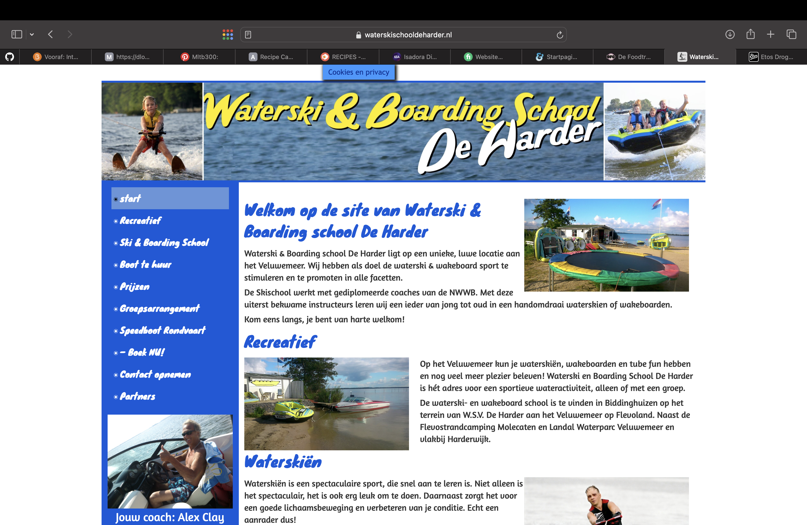

  #### Screenshot(s) van de tweede pagina (small screen):
  Contact opnemen 
  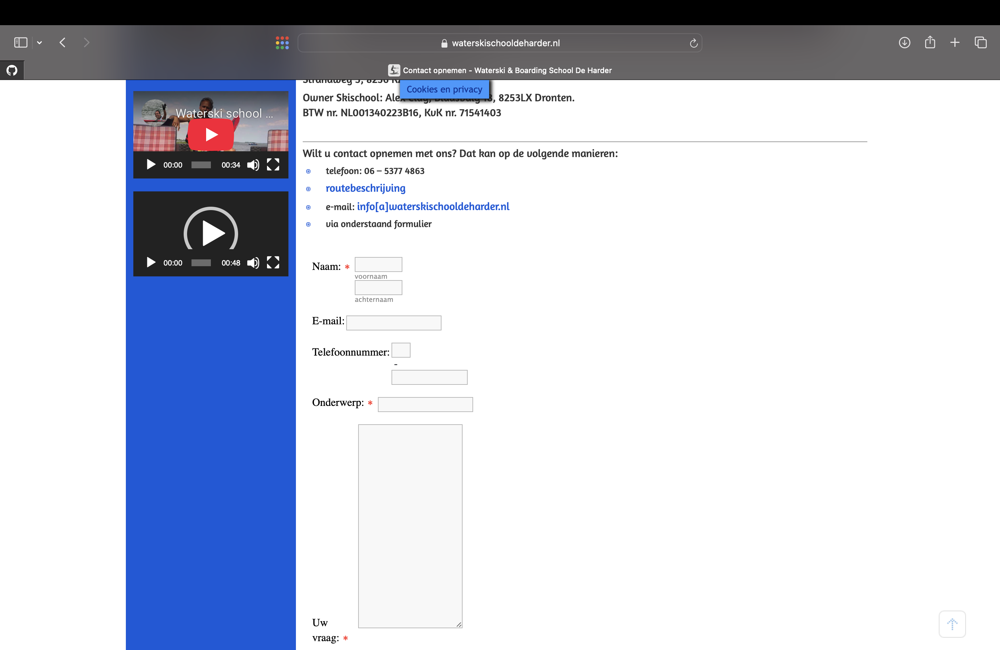
 

## Toegankelijkheidstest 1/2 (week 1)

  
uitwerken na test in 2e werkgroep

  ### Bevindingen
  Lijst met je bevindingen die in de test naar voren kwamen:
  - De startpagina heeft geen H1, 9 keer een h2 en een h3 in de footer. De screenreader leest eerst het navigatie menu en de video's, maar niet de hoofdtekst. 
  - De 'prijzen' pagina heeft een H2 en een H3, echter staan er eerst een hoop tabellen, en pas onderaan een H2. De footer is een H3. De tabellen missen dus een kop met bijvoorbeeld 'tarieven' en subkopjes.
  - de 'contact opnemen' pagina heeft geen koppen, enkel weer de H3 in de footer. Hier is behoefte aan meerdere logische koppen. 

  Wat er ook mist bij elke pagina, is een duidelijk visueel onderscheid van de koppen, ook voor mensen zonder beperking is het niet duidelijk.

## Breakdownschets (week 1)

  
uitwerken na afloop 3e werkgroep

  ### de hele pagina: 
  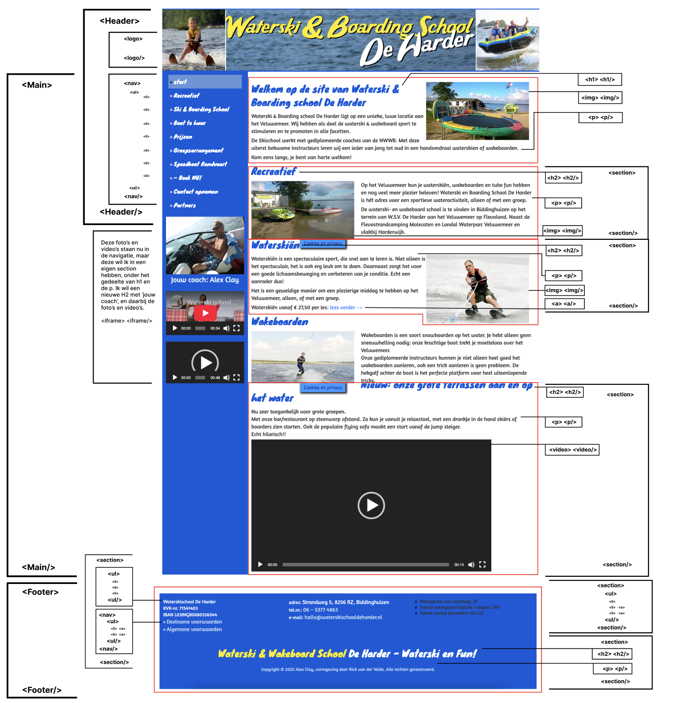

  ### dynamisch deel (bijv menu): 
  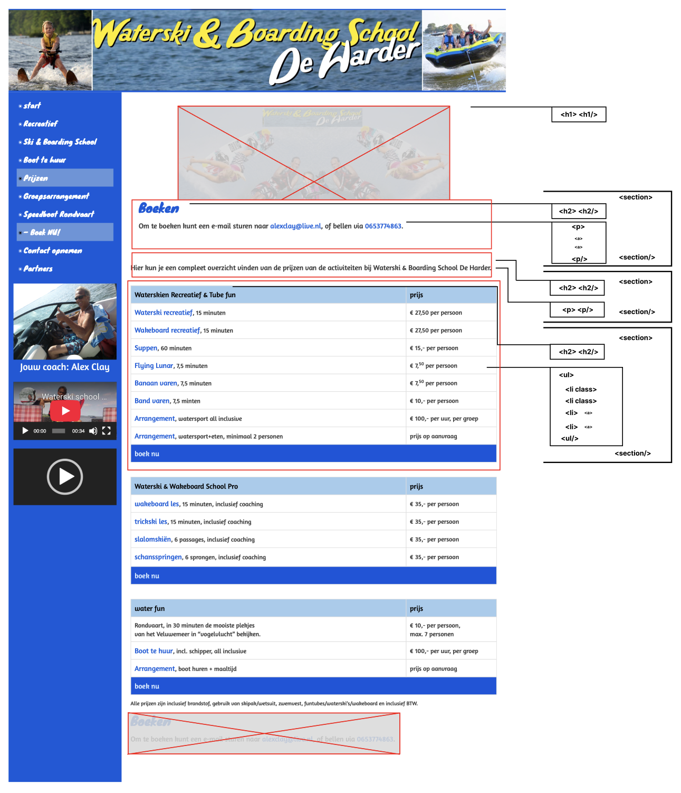

  ### wellicht nog een dynamisch deel (bijv filter): 
  

## Voortgang 1 (week 2)

  
uitwerken voor 1e voortgang

  ### Stand van zaken
 Het was eindelijk gelukt met het hamburger menu. Er waren later wel wat problemen: soms doet de knop het niet en zie je elementen die erachter moeten staan erdoorheen. Het eerste probleem heb ik niet opgelost, maar het tweede wel (met z-index).

  

  ### Agenda voor meeting
  samen met je groepje opstellen

  | Jada                                         | Daniel                           | Sid                                 |   Annabel        |
  | ---                                          | ---                              | ---                                 | ---              |
  | - hoe tekst meer naar links                  | - meerdere hamburger menu's      | - hoe advertenties                  | - hamburger menu |
  | - kan svg niet vinden | dit als er tijd is   | - font face werkt niet           | - achtergrond zoals echte website   | - nav meeschalen
  | - hoe order aanpassen van h2 en h3           | - video aan zijkanten vervagen   | - zoekbalk                          | - witruimte tekst|
                                                                                                                  

  ### Verslag van meeting
  Het gaat de goede kant op, maar:
  -  Padding op de main in %'s voor spacing aan de zijkanten en evt bovenkant.
  - Namen van stylesheets veranderen. 
  - alt teksten beter bescrhijven.
  - Voor losse kaartjes gebruikt het article element.  
  - <address> element gebruiken voor adres.

## Voortgang 2 (week 3)

  
uitwerken voor 2e voortgang

  ### Stand van zaken
 Ik ben bijna klaar met de eerste pagina, maar ik loopt tegen wat dingen aan. Ik moet nog een logo toevoegen maar weet nog niet welke en hoe. En sommige elementen willen maar niet in het midden staan. Verder ben ik wel trots op mijn video die een play en pause button heeft nu. 

  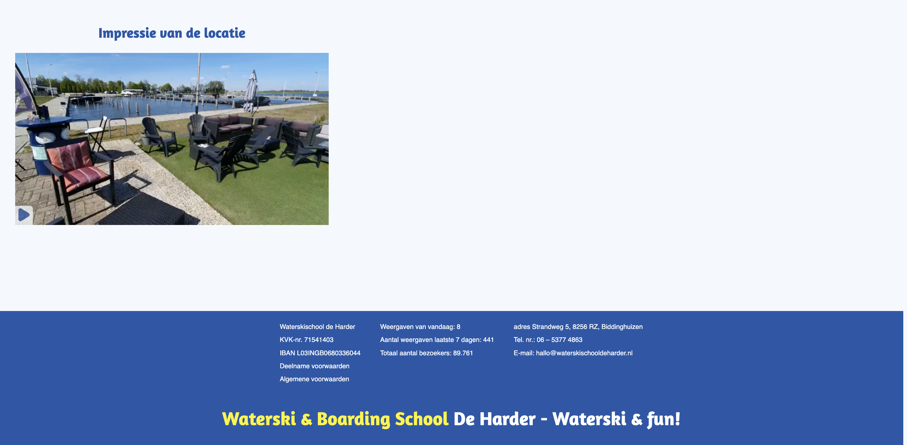

  ### Agenda voor meeting
  samen met je groepje opstellen

  | Jada                                         | Daniel                           | Sid                                 |   Annabel          |
  | ---                                          | ---                              | ---                                 | ---                |
  | - hoe svg en link naast elkaar               | - x                              | - betere manier css styling         | - h2 in midden     |
  | - hoe zwart vierkant achter time             | - x                              | - eerst desktop en dan resp.?       | - h2 en video      |
  | - hoe h1 samen met nav                       | - x                              | - welke dingen beter structureren   | - afbeelding header|

  ### Verslag van meeting
  hier na afloop snel de uitkomsten van de meeting vastleggen

  - H2 in het midden lukte niet omdat ik css h3 selecteerde ipv h2.
  - h2 en video in midden door display block en margin-inline auto.
  - logo hoeft geen svg te zijn, mag ook img

## Toegankelijkheidstest 2/2 (week 4)

  
uitwerken na test in 9e werkgroep

  ### Bevindingen
 Tijdens de tweede test merkte ik dat:
 - ik nog een animatie moest toevoegen.
 - mijn links nog niet allemaal te onderscheiden waren zonder kleur.
 - de skiplink niet zichtbaar werd bij focus.

  Verbeteringen:
- De beschrijvingen van links en buttons waren onduidelijk en lang. Op mijn website hebben ze duidelijke benamingen.
- Mijn html bevat geen fouten, enkel warnings over sections zonder headings.
- De tab op mijn website bevat dezelfde volgorde als de lay-out.
- de knoppen en tekstvelden op de originele website zaten dicht op elkaar en waren klein. Op mijn wesbite hebben ze genoeg ruimte en zijn ze goed klikbaar.
- Mijn website heeft op elke pagina een H1 en een juiste volgorde.
- de originele website heeft veel div's en classes/id's. Mijn website niet.
- Op de originele website heeft niet elke image een alt tekst, mijn website wel. 
- De originele website heeft geen alt tekst bij de tabellen. Mijn website heeft captions die worden voorgelezen door sr.
- De originele website heeft geen caption bij de video's. Mijn website heeft een heading boven de video.
- Mijn website heeft een skiplink die onzichtbaar is, tenzij je er op focust met tab.
- originele website heeft geen darkmode, mijn website wel.
- sommige links zijn zonder kleur niet te herkennen op de originele website. Op mijn website heeft (behalve de navigatie) elke link een underlining.
- op de originele website is de navigatie niet goed leesbaar door kleur contrast. Op mijn website wel, alleen het logo is minder goed zichtbaar bij dark mode.

## Voortgang 3 (week 4)

  
uitwerken voor 3e voortgang

  ### Stand van zaken
Ik ben erg trots op mijn kleine dialog waar je kan boeken (1e afbeelding). Het is alleen nog niet gelukt om het op elke pagina toe te passen.

Ik heb ook een lichte en een donkere modus gemaakt. 

Ik moet nu nog mijn code dubbel checken of het allemaal goed is, ik moet nog de alt tekst verbeteren en de naam van linkjes met aria-labels. Ik moet ook nog een animatie maken.

  

  

  

  ### Agenda voor meeting
  samen met je groepje opstellen

  | Jada                                         | Daniel                           | Sid       |   Annabel                                |
  | ---                                          | ---                              | ---       | ---                                      |
  | - Hoe tekst niet uit kader                   | - x                              | - x       | - Hoe laatste TD aanspreken in een tabel |
  | - hoe omlaag scrollen bij carroussel         | - x                              | - x       | - x                                      |
  | - hoe pijlen andere kleur                    | - x                              | - x       | - x                                      |

  ### Verslag van meeting
  hier na afloop snel de uitkomsten van de meeting vastleggen

- het veranderen van de kleur van de laatste tabel rij laten gaan, en focussen op de 'boeken' knop op twee pagina's.
- De 'boek' knop werkt nog niet op de tarieven pagina. Maak een nieuwe Javascript document.

## Eindgesprek (week 5)

  
uitwerken voor eindgesprek

  ### Je uitkomst - karakteristiek screenshots:
  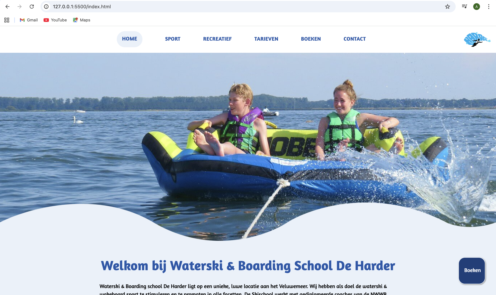
  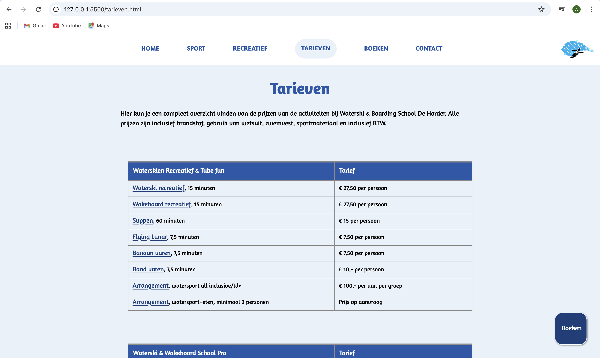
  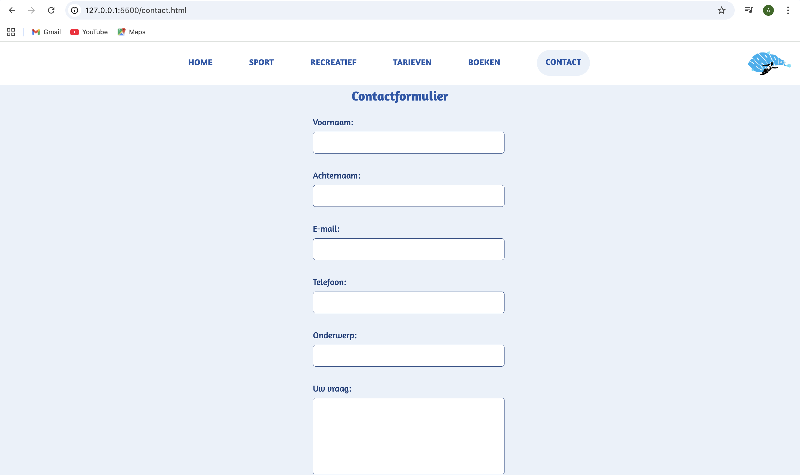

  ### Dit ging goed/Heb ik geleerd: 
Ik heb geleerd hoe ik een tabel en een formulier kan maken. Dit is niet in de les behandeld (waar ik aanwezig was), dus ik heb het zelf opgezocht op betrouwbare websites. Ik ben erg tevreden met de uitkomst. In de eerste afbeelding staat het formulier en in de tweede afbeelding de tabel.

In de derde afbeelding zie je de dialog die ik heb overgenomen van een van de lesopdrachten. Het was wel lastig om hem op meerdere pagina's te laten werken.

Ik was heel tevreden met hoe de kaarten eruit zagen. Ik vind het alleen niet zo mooi als de website scherm formaat is, dan verpringt het een beetje.

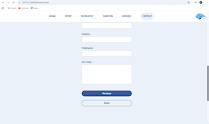

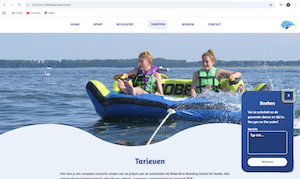

  ### Dit was lastig/Is niet gelukt:
 Ik wilde graag de tabel exact namaken, dus ook de laatste rij volledig blauw maken, maar dit lukte niet. Ik kreeg wel de laatste tijd blauw, maar niet de laatste kolom. Ik heb heel veel geprobeerd maar niks werkte. Ik heb er later voor gekozen om het weg te laten en dezelfde 'boek' knop te gebruiken als op de homepagina. Dit was ook niet makkelijk want die javascript code kon niet in 1 bestand. Dit kwam omdat ik ook nog javascript code heb voor de video op de home pagina. Ik heb geen video op mijn andere pagina's dus mijn browser raakte denk ik in de war. Ik heb daarom twee javascript bestanden aangemaakt en toen deed alles het weer.

 Ook had ik moeite met het hamburger menu en alle andere javascript elementen. De ene keer deden mijn functies het wel en de andere keer niet. Ik wist daardoor niet of het aan mijn code lag of aan de browser. Ik hoop daarom dat alles het wel gewoon doet tijdens het eindassessment.

 Wat niet is gelukt is dus die 'boeken' knop op elke pagina te plaatsen, dan moest ik drie javascript pagina's maken, en ik wist niet of twee bestanden uberhaubt was toegestaan. Ik heb de knop nu op de belangrijkste pagina's staan.

Wat ook niet is gelukt is een deel van mijn hamburger menu. Wanneer ik mijn hamburger menu uitklap en mijn scherm verbreed, dan gaat het menu mee en wordt het heel groot. Ik wist niet hoe ik dit moest oplossen. Bekijk de tweede afbeelding.

Op de contact pagina heb ik ook een link staan naar een e-mail adres, maar als het scherm heell klein wordt dan moet het adres ook heel klein worden anders gaat hij van het scherm af. Ik wist niet hoe ik dit moest oplossen.

Tenslotte had ik nog wat problemen met mijn dialog. In mijn css staat dubbel styling voor een button, maar als ik het ene weghaal, verdwijnt het ook bij een andere button. Ik heb dingen geprobeerd zoals code samenvoegen maar dan gaat het allemaal stuk. Ik heb het maar laten gaan. Op deze manier werkt het, en ik snap het wel voor 70%.

  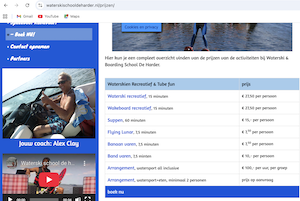
  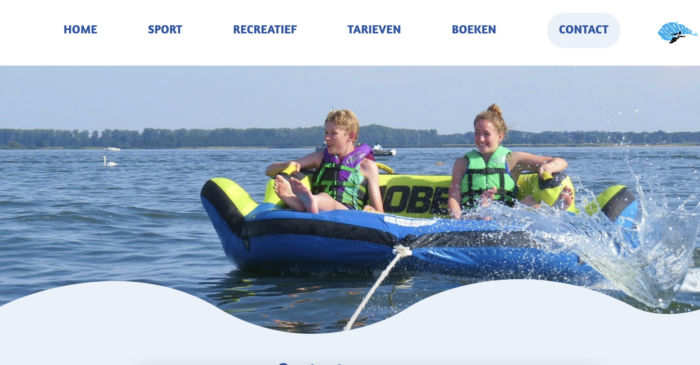

## Bronnenlijst

  
continu bijhouden terwijl je werkt

  1. Captions voor de tabel: https://www.w3schools.com/tags/tag_caption.asp
  2. Prefers-reduced-motion: uitleg: https://css-tricks.com/almanac/rules/m/media/prefers-reduced-motion/
  3. Uitleg over linear gradient kleur (ChatGPT) Prompt: kan je dit uitleggen: background: linear-gradient(-45deg, var(--nogdonkerehuiskleurblauw), var(--donkerehuiskleurblauw))
  4. Animatie 360 laten draaien (ChatGPT) Prompt: ik wil dat er maar een keer een hele draai wordt gedaan en dat het woord dan blijft staan en niet terugdraait: @keyframes schalen { /* jouw code hier */ 0% { transform: rotate(0deg); } 50%{ transform: rotate(360deg); } 100%{ transform: rotate(0deg); } }
  5. Hoe tabel stylen: https://www.w3schools.com/css/css_table.asp
  6. Hoe tabel in html: https://www.w3schools.com/html/html_tables.asp
  7. Codepen opdracht dialog: https://codepen.io/Annabellovesyou/pen/jEqpGpM
  8. prefers-color-scheme uitleg: https://developer.mozilla.org/en-US/docs/Web/CSS/Reference/At-rules/@media/prefers-color-scheme

